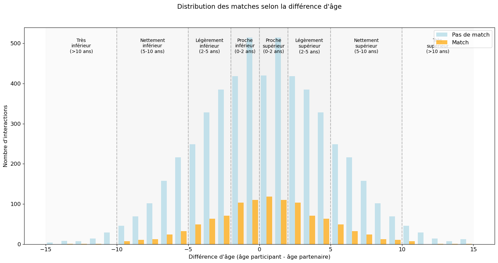

# Speed Dating Analysis 📊 


## 🎯 Objectif
Analyse d'un dataset de speed dating pour comprendre les facteurs de match dans le cadre d'une mission pour Tinder.

## 📋 Description
Face à une baisse des matches, Tinder cherche à comprendre ce qui fait que les gens s'intéressent les uns aux autres. Cette analyse se base sur des données de speed dating incluant :
- Informations démographiques
- Préférences déclarées
- Notes données pendant les rencontres
- Résultats des matches

## 🔍 Analyses Principales
1. Distribution des matches et facteurs de succès
2. Différences hommes/femmes
3. Impact de l'âge
4. Influence des carrières
5. Religion et origine ethnique
6. Intérêts communs
7. Evolution temporelle des critères

## 📊 Insights Clés
- Taux de match global : 16.5%
- Meilleur taux dans la tranche d'âge -2/+2 ans
- Écart entre préférences déclarées et comportement réel
- Impact significatif des intérêts communs

## 🛠 Technologies Utilisées
- Python
- Pandas pour la manipulation des données
- Seaborn/Matplotlib pour les visualisations ()
- NumPy pour les calculs statistiques

## 📈 Visualisations


## 📁 Structure du Projet
```speed-dating-analysis/
│
├── src/
│   └── Speed_Dating_Data.csv
│   └── Speed_Dating_Data_clean.csv
│   └── Speed_Dating_Data_Key.doc
│
├── tinder.ipynb
└── README.md
```
